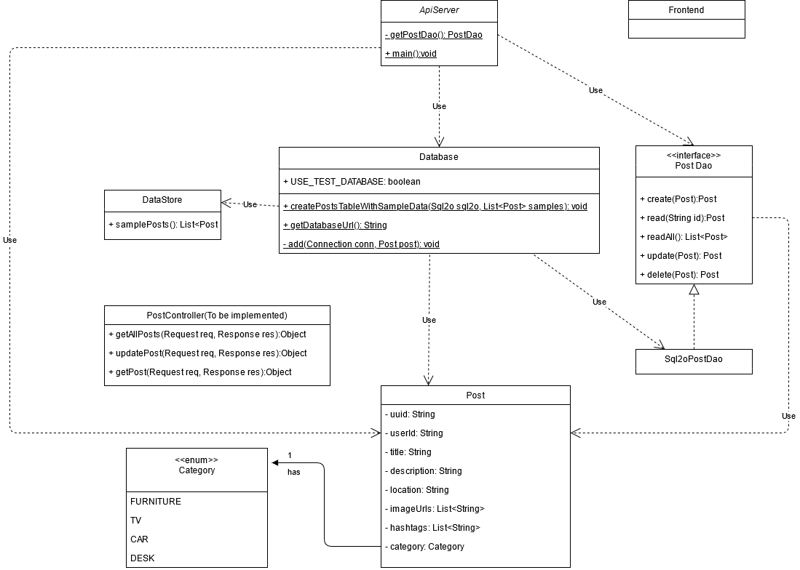

# Database

In this iteration, we only have one table in database.  

  

Thanks to PostgreSQL's fancy feature, we don't need to have separate tables just to store image URLs or hashtags.  

# Model

We now only have one model, Post, and a Category enum:  

  

# API doc:

[Postman team link](https://app.getpostman.com/join-team?invite_code=848573899a420ba71500fad415068a38)  

[Postman API documentation](https://documenter.getpostman.com/view/14357023/Tz5i8zkB)  

If anyone made a change to the backend structure, he should be responsible to update this document, including update the UML and database diagram.
