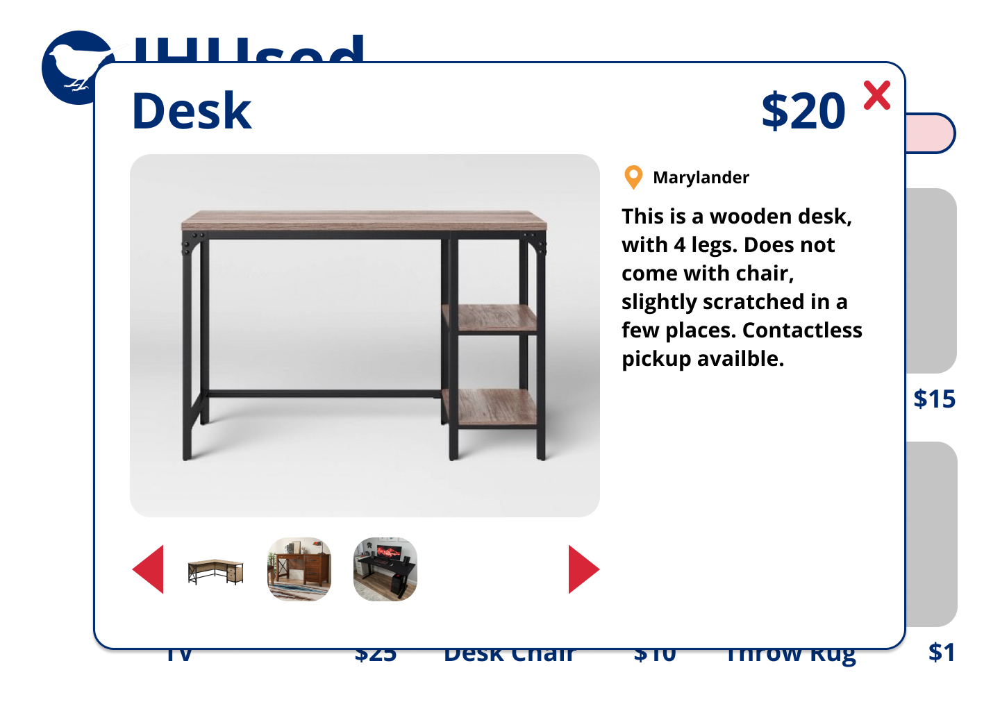

# Teamwork  
Team Leader: Chu Ding  

Additional meeting time(s) if needed:  
Tuesday, Wednesday, Thursday, 10-11pm EST

# OO Design  
* Front end (view): React app to render UI
* Backend
  * Server (controller): processing HTTP requests and sending responses
  * Post (model): model representation of posts created by users in the app
  * PostDao: dact access object interface for the model class to provide DB operations
  * Sql2oPostDao: concrete implementation of the PostDao interface 
  * Datastore: utility class to provide samples.
  * Database: utility class to refresh database, provide databaseurl, and generate sql2o.

# Wireframe & Use-case  

(Wireframe in progress)   

### Browsing the homepage
1. The user visits our web application using a web browser.  
2. The user will be presented with the homepage having sample posted items of different categories.  
3. In the homepage, the user can click on the posts to see their detailed descriptions.  
4. In the homepage, the user can type in a search query on the homepage, and will be redirected to the search page.  
5. In the homepage, the user can click on the “Create a New Post” icon and be redirected to the create post page.  

### Reading a post
(After clicking on a post)
1. The user will be directed to a page showing the title, image, and text description of the post clicked on.
2. The user will see the images in a slide show of images, along with a list of small images on the left of the slide show.
3. User can click on the image in the main window will open a large window showing the image
4. User can click on the arrows in the main window or the small image list to switch images

### Editing a post
(After clicking on the "create post" button)
1. The page will show a editing panel to the user, which contains the boxes for post title, price, location, category, description and options to upload image
2. The user will need to fill at least the title, price, description boxes before clicking the submit button to submit a post.
3. After clicking on the submit button, the user can be redirected to page telling user that the post has been submitted successfully. 

# Iteration Backlog  
* As a user, I want to create posts, so that I can buy/sell things  
* As a user, I want to include text in the post, so that I can describe things  
* As a user, I want to include image in the post, so that I can show other 
users more clearly  
* As a user, I want to click on a specific post, so that I can see the details 
of the item  

# Tasks  
* Set up basic client/server architecture using Java Spark and React (done)
* Hello World application (done) 
* Database set up/design
  * Add images to populate the sample data
* Create a post class (done)
 ----------------
* Database design (Qiao, Louie, Bohua)
* Homepage
  * React rendering the post list (Junjie)
  * Implement clicking on a post to see post details (Junjie, Sam)
  * Server class api, getAll (Qiao, Louie, Bohua)
* Reading a post 
  * React rendering page/pop-up (Chu, Sam)
  * Sql2oPostDao read() method (Qiao, Louie, Bohua)
  * Server class api, get (Qiao, Louie, Bohua)
* Editing a post
  * React rendering forms, image-upload (Chu, Sam) (imgur, flicker...github projects to start)
  * Sql2oPostDao create() method (Qiao, Louie, Bohua)
  * Server class api, post (Qiao, Louie, Bohua)

# Retrospective  
What we have done:
* We have implemented the features required for all of the four user stories planned for this iteration. 
* We have set up a working web application with Spark java backend + postgreSQL databse and ReactJS frontend. Getting familiar with these technology stacks in this iteration allow the team to add other features more smoothly in next a few iteartions.
* We have created the data structure used in the database to represent post data
* We have created the class design to support the backend implementation
* We have secured Firebase as the third party storage to host all of our post images
* We have created an identifiable UI design for our web app

What we have not done:
* We didn't make user return to the homepage after submitting the post, which is feature we should implement in the next iteration, but we didn't miss any features required for implementing the user stories planned for this iteration

What we have learned
* Turning user story into very detailed tasks such as building a specific class seem to really help dividing tasks among teammates

