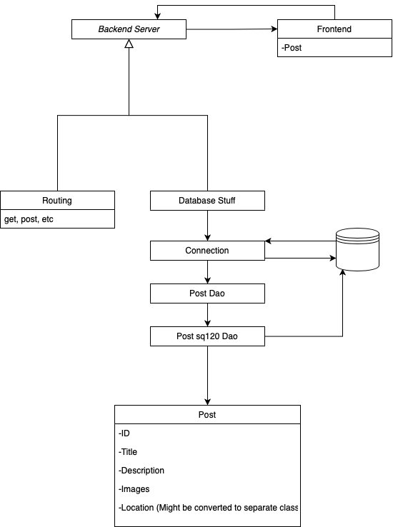
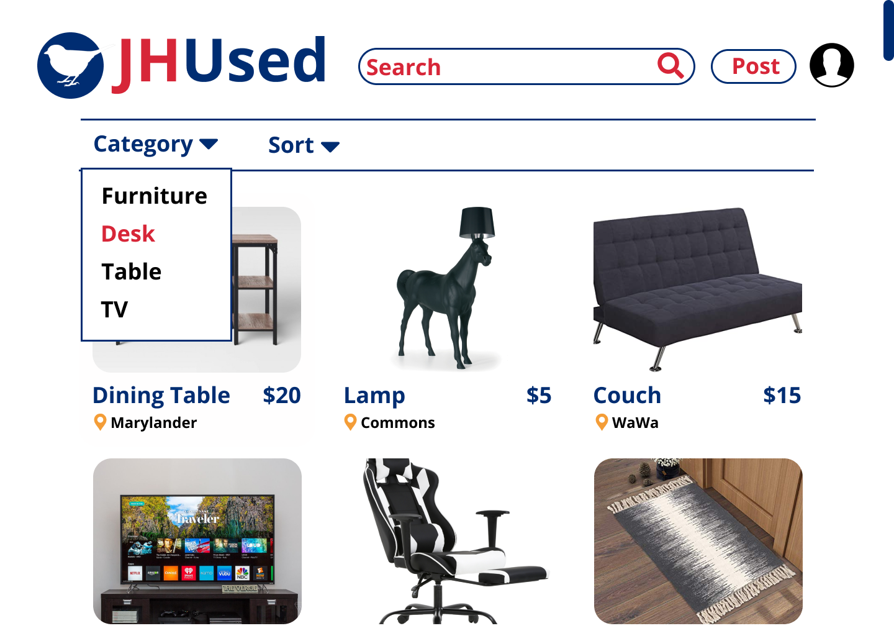
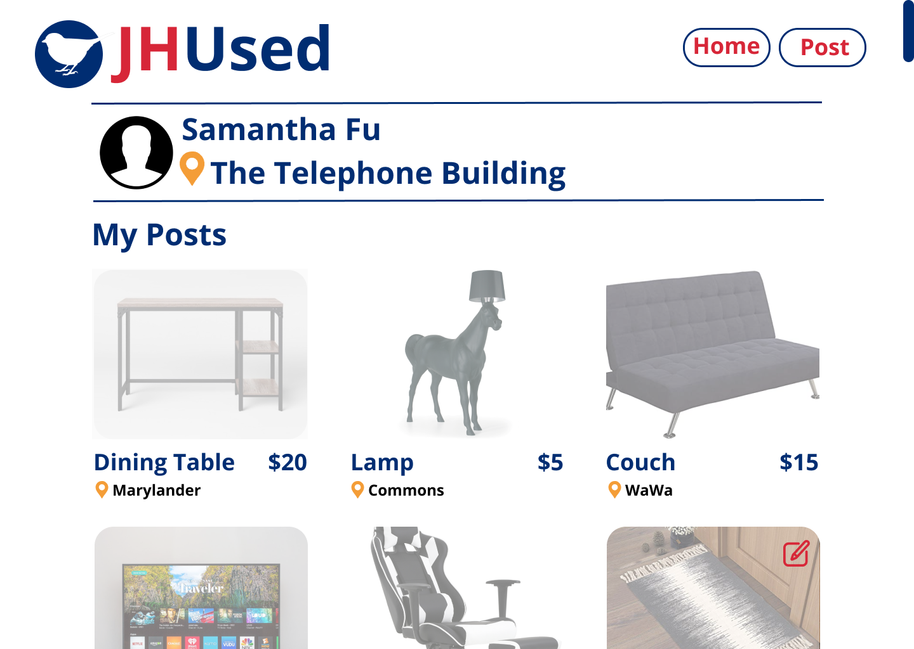
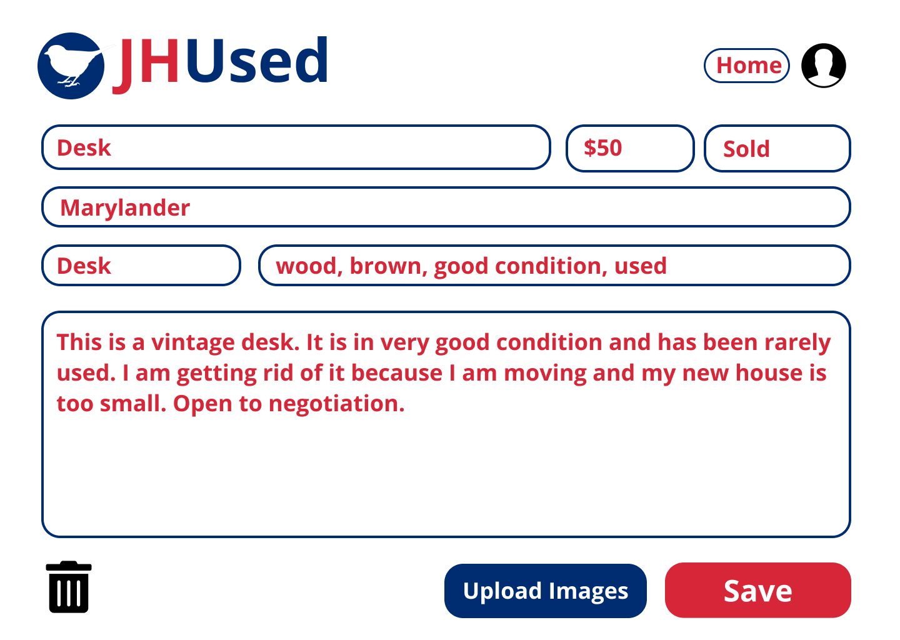

# Teamwork  
Team Leader: Samantha Fu 

Additional meeting time(s) if needed:  
Tuesday, Wednesday, Thursday, 10-11pm EST

# OO Design  
* Front end (view): React app to render UI
* Backend
  * Server (controller): processing HTTP requests and sending responses
  * Post (model): model representation of posts created by users in the app
  * PostDao: dact access object interface for the model class to provide DB operations
  * Sql2oPostDao: concrete implementation of the PostDao interface 
  * Datastore: utility class to provide samples.
  * Database: utility class to refresh database, provide databaseurl, and generate sql2o.

# Wireframe & Use-case  

# Iteration Backlog  
* As a user, I want to post an item with tags for its category, so that a buyer can search through category  
* As a user, I want to edit my posts after I post, so that I can update the post when I feel like to  
* As a user, I want to mark something as sold, so that selling information is kept up to date.  
* As a user, I want to browse items by category, so that I can search for specific things to buy.  
* As a user, I want to search for the item/service I am interested in, so that I don’t have to see things that I don’t want 

# Tasks  
Post Editing
- [ ] myPage of posts for editing (Sam)
- [ ] Route for myPage + button to navigate there (Sam)
- [ ] Editing UI form (same as before, but with data populated) (Chu)

Mark Item as Sold
- [ ] Modify Database design (Qiao)
- [ ] UI button for updating status - in post editor (Chu)
- [ ] Homepage should only render unsold items - frontend job (Bohua)

Filter by Category
- [ ] Button for category filtering (Junjie)

Sorting
- [ ] One route method w/ query params (Chu)
- [ ] Frontend choose sort type (Bohua)

Search
- [ ] Update backend search - description, location, title, tags (Louie)
- [ ] Frontend UI search bar (Junjie)

Backlog 
- [x] Create post redirect to home page (Chu)
- [x] Allow deletion of tags (Chu)
- [ ] Make post detail popup not expand (Sam)
- [ ] Show avaiable hashtags in the hastag select (Chu)
- [ ] Pagination (if we have time) - update API & frontend ui to show pages
- [ ] Media queries for responsiveness :(

# Retrospective  
