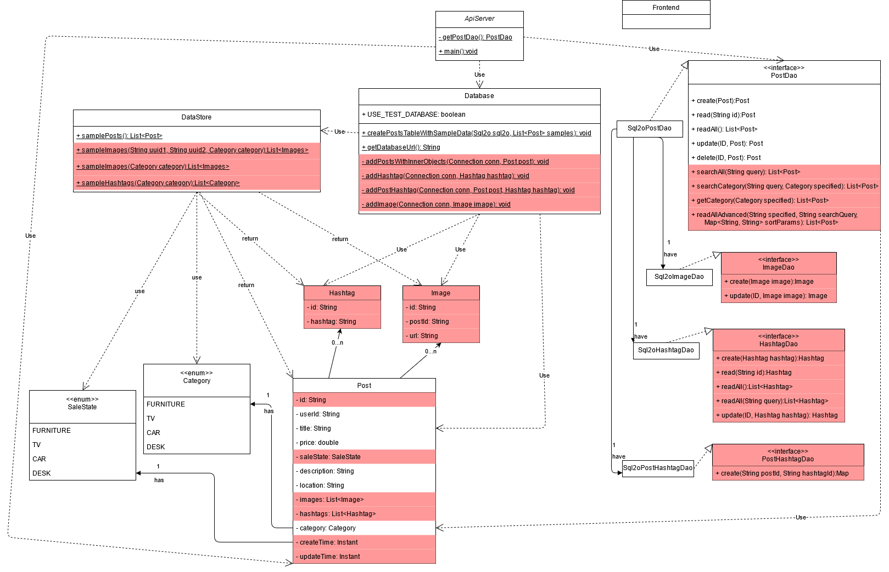

# Teamwork
Team Leader: Bohua Wan

Additional meeting time(s) if needed:  
Tuesday, Wednesday, Thursday, 10-11pm EST

# OO Design
* Front end (view): React app to render UI
* Backend
  * Server (controller): processing HTTP requests and sending responses
  * Post (model): model representation of posts created by users in the app
  * PostDao: dact access object interface for the model class to provide DB operations
  * Sql2oPostDao: concrete implementation of the PostDao interface 
  * Datastore: utility class to provide samples.
  * Database: utility class to refresh database, provide databaseurl, and generate sql2o.

# Wireframe & Use-case

### Browsing the homepage
1. The user visits our web application using a web browser.
2. The user will be presented with the homepage having sample posted items of different categories.
3. The user can choose to only see items from certain category by choosing the drop down category.
4. The user can choose the order of items listed by selecting in the sort drop style(most recent, least recent, price low to high, price hight to low).
6. The user can visit the account page by clicking the account icon.
7. The user can open the chat box in homepage to view messages.

### Chatting box
1. The user can chat with other users in this box.

### Reading a post
(After clicking on a post)
1. The user will see a pop up showing the title, image, and text description of the post clicked on.
2. The user will see the images in a slide show of images, along with a list of small images on the left of the slide show.
3. The user can click on the arrows in the main window or the small image list to switch images
4. The user can visit the account page of the user who posted this post by clicking on the user's name link.

### Account page for user
(After clicking on post on the account button)
1. The user can visit an account page where the username, location, and items posted by the user will be displayed.
2. The user can click on the home button to go back to the homepage where all posts are displayed.
3. The user can open the chat box in his/her account page to view messages.
4. The user can start a chat when visiting other's account page by clicking a button.
5. The user can click on a button to open an edit pop up to edit the user's information.

### Account information editing page

1. The user can edit location, preferred email, and preferred user name in this editing page.  
2. If it's the user's first login, this page contain no default information, other wise, it is filled with original values.  

# Iteration Backlog

As a user, I want to have the chatting feature, so that I can coordinate with the person on the other end  
As a user, I want to login into the platform, so that I can access my past activities  
As a user, I want to sign up an account, so that I can log in  

# Tasks

- [ ] Migrate to JDBI3 (Bohua)
- [ ] Login Backend
  - [ ]  Database Design, user table, user dao, user api (Qiao)
    - [ ]   Setup User table (JHID, preferred name, location, preferred email)
    - [ ]   Setup User model
    - [ ]   User dao
    - [ ]   CRUD api for User
    - [ ]   Email user when post get sold api (nice to have)
  - [ ] SSO apis & functions (Bohua, Louie)
    - [ ] Handle redirect from frontend (when user click account button but not yet login) to redirect to SSO api
    - [ ] Handle SSO call back
    - [ ] Handle SSO encription and decription
  - [ ] Handle Sessions (Bohua, Louie)
- [ ] Login Frontend
  - [ ] Editing user information page (route to this page/pop up in account page (must login))
    - [ ] Preferred email
    - [ ] Preferred name
    - [ ] Location
  - [ ] Handle user's login status
    - [ ] Check if user is logged in
    - [ ] Redirect to login backend api url if not
- [ ] User frontend
  - [ ] Add user link in post detail to allow user to visit the post owner's user page. (Sam)
  - [ ] Add user information editing button in his/her account page to open the "Editing user information page".
- [ ] Chatting box
  - [ ] Look into firebase to use their chatting plugin.
  - [ ] Add chat box button in homepage and account page to allow user check his/her messages.
  - [ ] Add start chatting button in other user's account page to start conversation.
- [ ] Migrate to Tailwind CSS framework (gradually, no need to get all done in this iteration)
  - [ ] Homepage
  - [ ] post detail
  - [ ] post editing
  - [ ] account page

# Retrospective
