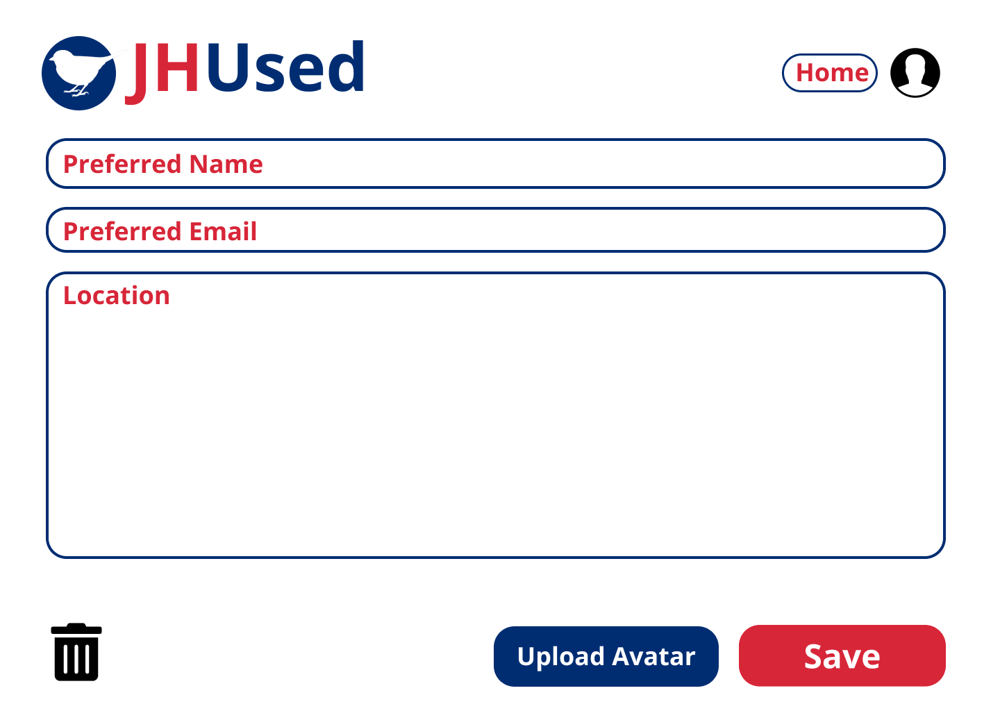

# Teamwork
Team Leader: Bohua Wan

Additional meeting time(s) if needed:  
Tuesday, Wednesday, Thursday, 10-11pm EST

# OO Design
* Front end (view): React app to render UI
* Backend
  * Server (controller): processing HTTP requests and sending responses
  * Post (model): model representation of posts created by users in the app
  * PostDao: dact access object interface for the model class to provide DB operations
  * JdbiPostDao: concrete implementation of the PostDao interface 
  * Datastore: utility class to provide samples.
  * Database: utility class to refresh database, provide databaseurl, and generate sql2o.

# Wireframe & Use-case

### Browsing the homepage
1. The user visits our web application using a web browser.
2. The user will be presented with the homepage having sample posted items of different categories.
3. The user can choose to only see items from certain category by choosing the drop down category.
4. The user can choose the order of items listed by selecting in the sort drop style(most recent, least recent, price low to high, price hight to low).
6. The user can visit the account page by clicking the "Your Profile" from the drop down menu of the account icon.
7. The user can open the chat box by clicking the "Messages" from the drop down menu of the account icon. to view messages.
8. The user can login by clicking the Login button and then redirect to JHU SSO to login, then redirect to information registration page, and then back to homepage with logged in status.

### Chatting box
1. The user can chat with other users in this box.

### Reading a post
(After clicking on a post)
1. The user will see a pop up showing the title, image, and text description of the post clicked on.
2. The user will see the images in a slide show of images, along with a list of small images on the left of the slide show.
3. The user can click on the arrows in the main window or the small image list to switch images
4. The user can visit the account page of the user who posted this post by clicking on the user's icon.
5. The user can message the seller by clicking on the "Message Sellar" button.

### Account page for user
(After clicking on post on the account button)
1. The user can visit an account page where the username, location, and items posted by the user will be displayed.
2. The user can click on the home button to go back to the homepage where all posts are displayed.
3. The user can open the chat box in his/her account page to view messages.
4. The user can start a chat when visiting other's account page by clicking a button.
5. The user can click on a button to open an edit pop up to edit the user's information.

### Account information editing page

1. The user can edit location, preferred email,  preferred user name, and upload avatar (an image) in this editing page.  
2. If it's the user's first login, this page contain default information based on user's JHED, other wise, it is filled with original values.  

# Iteration Backlog

As a user, I want to have the chatting feature, so that I can coordinate with the person on the other end  
As a user, I want to login into the platform, so that I can access my past activities  
As a user, I want to sign up an account, so that I can log in  
As a user, I want to login into the platform using my JHED account to verify my identity, so that sign up and login will be easy  
As a user, I want to make a wish list, so that I can show people what things I am looking for

# Tasks
- [ ] Implement wish list feature (Louie:Backend; Sam:Frontend)
- [X] Migrate to JDBI3 (Bohua)
- [x] Login Backend
  - [X]  Database Design, user table, user dao, user api (Qiao)
    - [X]   Setup User table (JHID, image_url, preferred name, location, preferred email)
    - [X]   Setup User model（listOfPosts）
    - [X]   User dao
    - [X]   CRUD api for User
  - [x] SSO apis & functions (Bohua, Louie)
    - [x] Handle redirect from frontend (when user click account button but not yet login) to redirect to SSO api
    - [x] Handle SSO call back
    - [x] Handle SSO encription and decription
  - [x] Handle Sessions (Bohua, Louie)
- [x] Login Frontend
  - [x] Editing user information page (route to this page/pop up in account page (must login)) (Chu)
  - [x] Handle user's login status (Junjie)
    - [x] Check if user is logged in
    - [x] Redirect to login backend api url if not
- [X] User frontend
  - [X] Add user link in post detail to allow user to visit the post owner's user page. (Sam)
  - [X] Add user information editing button in his/her account page to open the "Editing user information page". (Sam)
- [ ] Chatting box
  - [ ] Chat box component - firebase or other 3rd party lib (Junjie, Chu)
  - [x] Add chat box button in homepage and account page to allow user check his/her messages. (Sam)
  - [x] Add start chatting button in other user's account page to start conversation. (Sam)
- [X] Migrate to Tailwind CSS framework (gradually, no need to get all done in this iteration)
  - [X] Homepage (Sam)
  - [X] post detail (Sam)
  - [x] post editing (Chu)
  - [X] account page (Bohua)
- [ ] Extend past activity functionalities (If we have time)
  - [ ] Implement my favorite posts (post detail have a heart, click then favorite it, show a list of favorites in account page)
  - [ ] Implement history of post creation, edition, view
- [ ] Pagination (If we have time)

# Retrospective

What we have done:
* We have implemented the all the basic features of the user stories in this iteration.
* We have successfully integrated the JHU SSO to our application. JHU students can login using their JHU account, and edit their prefered name, email, avatar, and location in our application.
* We have added a realtime chatting feature in the frontend using Socket.IO and have set up a separate chatting sever. We have also provided Apis to support chatting history persistance.
* We have added a basic wish list feature, through which user can add posts to the user's wish list.
* We have migrated to Tailwind CSS framework. Now, our app is media responsive, looks good on variaous devices. We have begun to adjust our application's style moving towards a more morden styled ecommerce website like Etsy and Depop.
* We have added user input form validations and remainders to make editing posts or user's profile more user friendly.
* We have migrated from Sql2o to Jdbi3. Now we can use join sqls to retrieve complex models with 1 database connection, which speeds up our application. However, due to the fact that we are using Firebase to sotre images, so the images have to be downloaded after user renders the frontend page. This cause a delay in showing posts.
* We have added 4 additional nice-to-have user stories, which will help our application go beyond CRUD.

What we have not done:
* We have not made the wish list feature rich enough. We will add notification to wish list.
* We have not made the chatting persistant. Although, we have all Apis ready, we did not have time to integrate with the frontend. In the next iteration, we will definately be able to add persistant to chatting.
* We have not implemented the pagination yet. It's an optional task, and will consider implementing it in the next iteration.
* We have not made our application looks more fancy. We did start using the Tailwind css framework, and adjusted the style gradually. In the next iteration, we will shift more time on this task.
* We have not made our application go very beyond CRUD, but we now have a clear plan on how should we do that. We have added several additional nice-to-have user stories that can help our application go beyond CRUD. We will implement them in the following iterations. In the following iterations, we have much less user stories comparing with iteration 1 to 3, so we will have more time concentrating on going beyond CRUD.

Challenges
* Migrating from Sql2o to Jdbi3 is challenging. We have to write our own result set handler to handle complex joins. We used java reflection to solve this. Some backend members feel challenged and met some issue adjusting to Jdbi3, we helped each other and finished all the backend jobs.
* Integrating JHU SSO is also very challenging. Due to the fact, we have separate frontend and backend, our case is not very common, and resources are even less on the Internet. We have met issues with Cross-origin resource sharing. It's hard to figure out how our application login flow should be. As the SP-Metadata is only registered for our deployed server, developing in local became challenging, have to use another IDP for local development.
* We met some challenges dealing with Bootstrap and Tailwind conflicts when developing the chat feature. We have to migrate from Bootstrap to Tailwind.

How should we improve:
* We should make a draft of Apis at the begining of the iteration, and update and communicate with each other frequently. Many of our jobs depends on each other, so some has to wait for others to finish their jobs. Hope planing will ease this problem.
