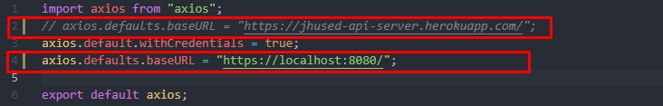

## How to debug on your local machine with SamlTest SSO

### Development Setup

#### Backend

1. Open backend using Idea.

2. Add environmental variable "MODE" to "DEBUG" like image below to api/ApiServer:

     

3. Run ApiServer.

#### Frontend

**NOTE: THIS ONLY WORKS ON FIREFOX, TO ENABLE LOCAL DEV ON CHROME, NEED TO SETUP HTTPS FOR FRONTEND AS WELL.**  I'm not familiar with craco.

1. Open frontend using an editor like vscode or whatever you are using.

2. Change the backend login url to local url in component/Header.js like below:

     

3. Change the axios' base request url to local url in util/axios.js like this:

     

4. Run frontend.
5. **DON'T FORGET TO UNDO THE CHANGES IN FRONTEND WHEN PUSHING OR DEPLOYING.**

### What you should see

1. Open a browser
2. Visit [http://localhost:3000](http://localhost:3000)
3. You should see the homepage, click the Login at up right corner
4. You should be first redirected to [https://localhost:8080/jhu/login](https://localhost:8080/jhu/login), then you should see a third party SSO like this:
 
5. Then use user name and password provided in the red rectangle to login.
6. Then it will request you to accept some dummy permission, just click accept at the bottom.
7. Then you should be able to login.

