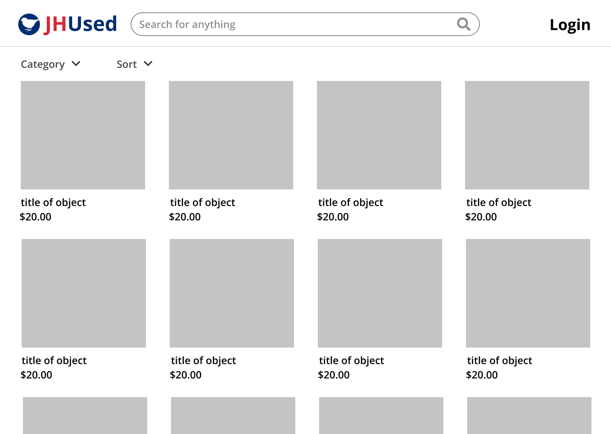
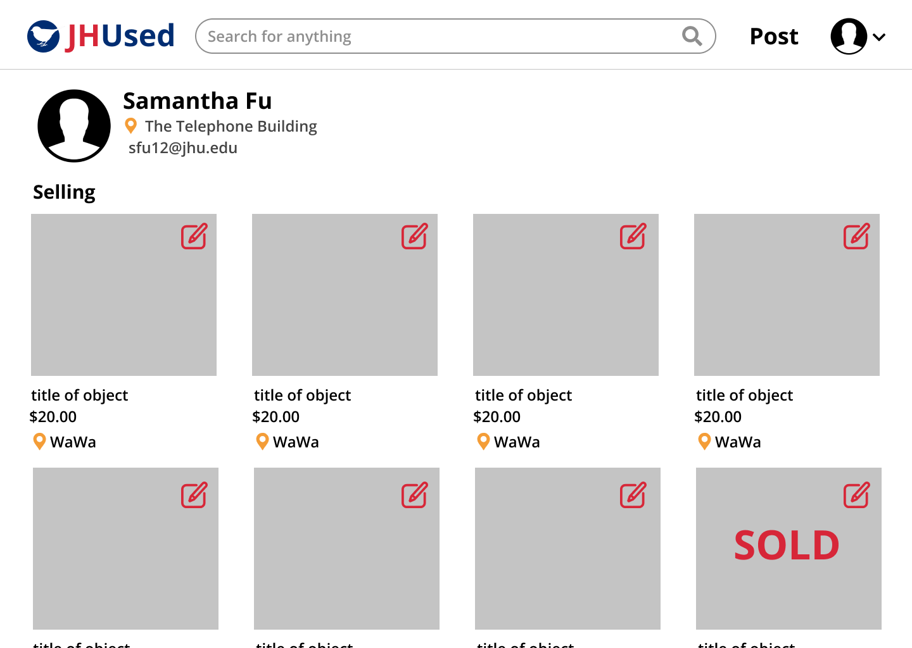

# Teamwork
Team Leader: Qiao Lu

Additional meeting time(s) if needed:  
Tuesday, Wednesday, Thursday, 10-11pm EST

# OO Design
* Front end (view): React app to render UI
* Backend
  * Server (controller): processing HTTP requests and sending responses
  * Post-related (model)(Including image, hashtag): model representation of posts created by users in the app
  * User-realated (model)(Including models such as wishlistskeleton): model representation of users in the app
  * Message(model): model of messages communicated between users
  * PostDao: dact access object interface for the model class to provide DB operations
  * JdbiPostDao: concrete implementation of the PostDao interface
  * Datastore: utility class to provide samples.
  * Database: utility class to refresh database, provide databaseurl, and generate sql2o.

# Wireframe & Use-case

### Browsing the homepage
1. The user visits our web application using a web browser.
2. The user will be presented with the homepage having sample posted items of different categories.
3. The user can choose to only see items from certain category by choosing the drop down category.
4. The user can choose the order of items listed by selecting in the sort drop style(most recent, least recent, price low to high, price hight to low).
6. The user can visit the account page by clicking the "Your Profile" from the drop down menu of the account icon.
7. The user can open the chat box by clicking the "Messages" from the drop down menu of the account icon. to view messages.
8. The user can login by clicking the Login button and then redirect to JHU SSO to login, then redirect to information registration page, and then back to homepage with logged in status.

### Chatting box
1. The user can chat with other users in this box.

### Reading a post
(After clicking on a post)
1. The user will see a pop up showing the title, image, and text description of the post clicked on.
2. The user will see the images in a slide show of images, along with a list of small images on the left of the slide show.
3. The user can click on the arrows in the main window or the small image list to switch images
4. The user can visit the account page of the user who posted this post by clicking on the user's icon.
5. The user can message the seller by clicking on the "Message Seller" button.

### Account page for user
(After clicking on post on the account button)
1. The user can visit an account page where the username, location, and items posted by the user will be displayed.
2. The user can click on the home button to go back to the homepage where all posts are displayed.
3. The user can open the chat box in his/her account page to view messages.
4. The user can start a chat when visiting other's account page by clicking a button.
5. The user can click on a button to open an edit pop up to edit the user's information.

### Account information editing page

1. The user can edit location, preferred email,  preferred user name, and upload avatar (an image) in this editing page.  
2. If it's the user's first login, this page contain default information based on user's JHED, other wise, it is filled with original values.  

# Iteration Backlog
As a user, I want to have the chatting feature, so that I can coordinate with the person on the other end  
As a user, I want to create a feedback system for buyer to rate Seller
As a user, I want to send notification emails to users

# Tasks
- [ ] Issues to fix
  - [ ]  JHU Login completely broken in Safari (Bohua)
  - [ ]  Header w/o search bar for chat (sam)
  - [X]  Search without Browser Force Refresh, if possible (sam)
  - [ ]  Logout
  - [ ]  Pagination (Bohua)
  - [X]  Chat Page
    - [X]  Differentiate read/unread messages, New messages notification (Junjie)
    - [X]  Frontend
      - [X]  Delete messages (chu)
      - [X]  Delete contacts (chu)
      - [X]  Add user profile (qiao)
  - [ ]  Wishlist post heart not turning red in time
  - [X]  Invite more people to test out web app

- [ ] User Stories
  - [ ] Email/Desktop Notification
  - [ ] Seller Feedback (ratings)

# Retrospective

What we have done:
*

What we have not done:
*

Challenges
*

How should we improve:
*
