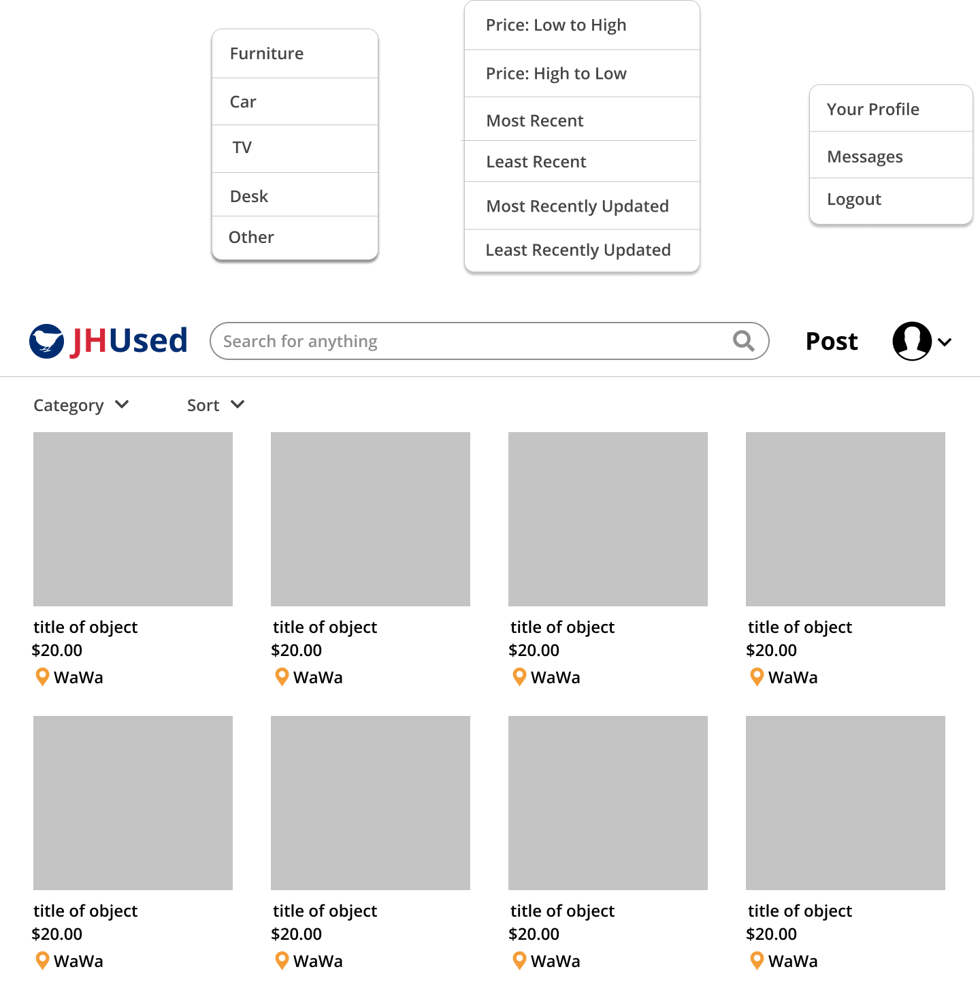
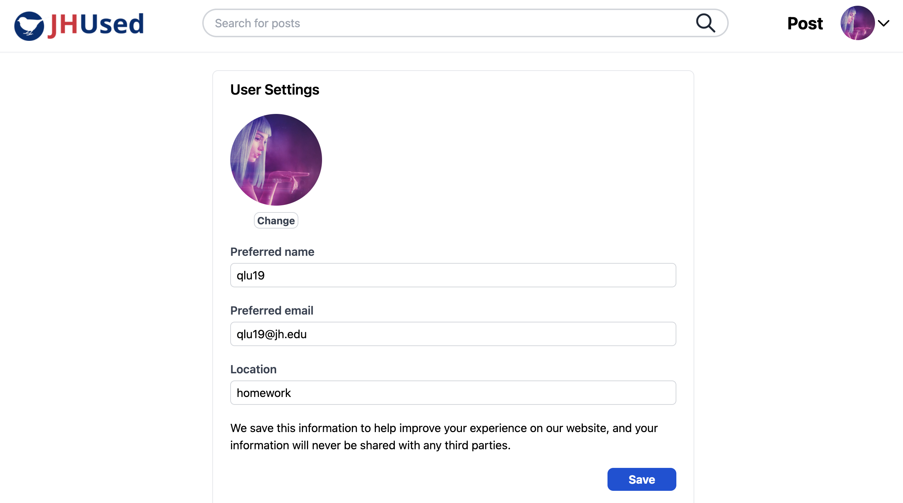

# Teamwork
Team Leader: Louie DiBernardo

Additional meeting time(s) if needed:  
Tuesday, Wednesday, Thursday, 10-11pm EST

# OO Design
* Front end (view): React app to render UI
* Backend
  * ApiServer: set jdbi, connect heroku, calls controllers
  * Controller: postController, messageController, SSOControler, wishlistController etc. that handles http requests
  * PostDao: dact access object interface for the model class to provide DB operations
  * JdbiPostDao: concrete implementation of the PostDao interface
  * Post-related (model)(Including image, hashtag): model representation of posts created by users in the app
  * User-realated (model)(Including models such as wishlistskeleton): model representation of users in the app
  * Message(model): model of messages communicated between users
  * Datastore: utility class to provide samples.
  * Database: utility class to refresh database, provide databaseurl, and generate sql2o.

# Wireframe & Use-case

### Browsing the homepage
1. The user visits our web application using a web browser.
2. The user will be presented with the homepage having sample posted items of different categories.
3. The user can choose to only see items from certain category by choosing the drop down category.
4. The user can choose the order of items listed by selecting in the sort drop style(most recent, least recent, price low to high, price hight to low).
6. The user can visit the account page by clicking the "Your Profile" from the drop down menu of the account icon.
7. The user can open the chat box by clicking the "Messages" from the drop down menu of the account icon. to view messages.
8. The user can login by clicking the Login button and then redirect to JHU SSO to login, then redirect to information registration page, and then back to homepage with logged in status.

### Chatting box
1. The user can chat with other users in this box.

### Reading a post
(After clicking on a post)
1. The user will be directed to the post page showing the title, image, and text description etc. of the post clicked on.
2. The user will see the images in a slide show of images, along with a list of small images on the left of the slide show.
3. The user can click on the arrows in the main window or the small image list to switch images
4. The user can visit the account page of the user who posted this post by clicking on the user's icon.
5. The user can message the seller by clicking on the "Message Seller" button.

### Account page for user
(After clicking on post on the account button)
1. The user can visit an account page where the username, location, and items posted by the user will be displayed.
2. The user can click on the home button to go back to the homepage where all posts are displayed.
3. The user can open the chat box in his/her account page to view messages.
4. The user can start a chat when visiting other's account page by clicking a button.
5. The user can click on the top right button to open an edit pop up to edit the user's information.
6. The user can visit posts listed and wishlist posts in their account by clicking on corresponding button.
7. The user can click on the pencil on the top right of a post to edit that post

### Account information editing page

1. The user can edit location, preferred email,  preferred user name, and upload avatar (an image) in this editing page.  
2. If it's the user's first login, this page contain default information based on user's JHED, other wise, it is filled with original values.  

### Post editing page

1. The user can edit the post details such as title, price, location images etc. by simply deleting or replacing the part
2. The user can update the post when finished by clicking the update button
3. The user can delete the post by clicking the delete button on the left bottom.

### GrabCut image

1. The user can use Grabcut OpenCV to separate background from the item
2. The user can save the processed image to local drive

# Iteration Backlog
As a user, I want to see the count of views of a post, so that I can check how popular that post is
As a user, I want to see other people’s location information, so that I can buy from others close to me

# Tasks
- [ ] Issues to fix
  - [x]  Fix Heroku (Junjie)
  - [ ]  Frontend did not pass existing hashtag id to backend.
  - [ ]  Duplicate hashtag crash
  - [x]  chat page is not showing the correct user profiles (Chu)
  - [x]  Invite more people to test out web app (everyone)
    - [ ] Fix bugs as we find/are notified about them. (everyone)

- [ ] User Stories
  - [ ] Pagination (Backend:Bohua, Frontend:Sam)
  - [ ] Marking post as sold
  - [x] Email confirmations for email changes (Louie)
  - [x] Email Preferences (Louie)
  - [x] chat notification sound (Junjie)
  - [x] Post View Count

# Retrospective

# What we have learned:
